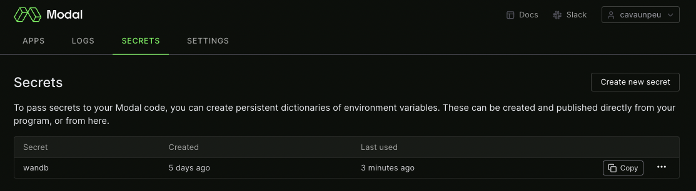
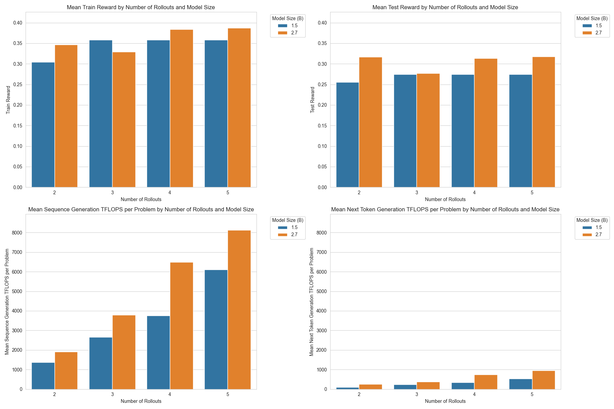
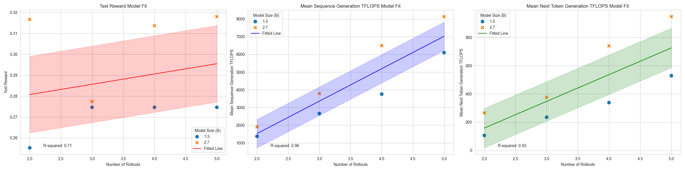
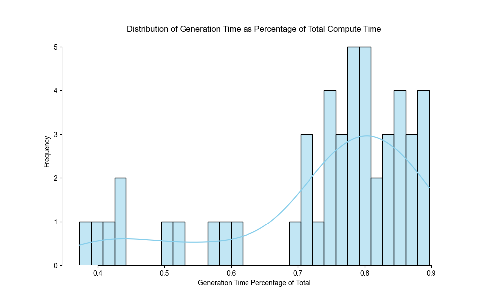
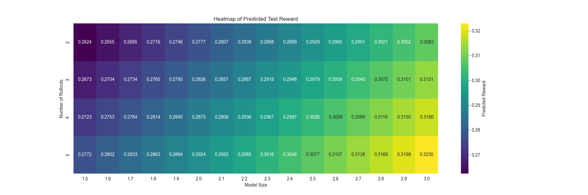
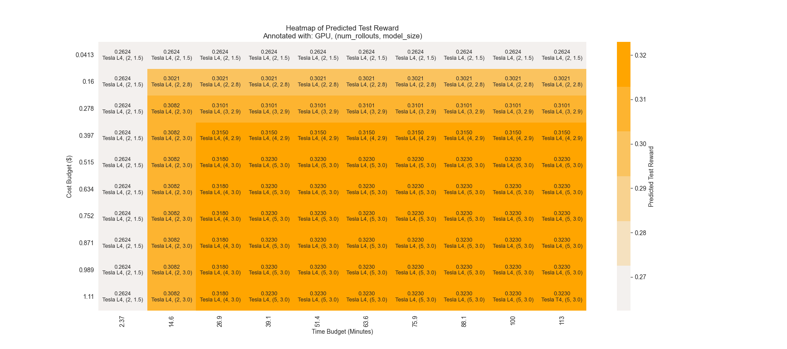

# MCTS with LLMs for Code Generation, via Modal

This repository contains a reimplementation of ["Planning with Large Language Models for Code Generation"](https://arxiv.org/abs/2303.05510) by Zhang et al. In addition, it contains a novel, trie-like caching structure for generated LLM sequences. Finally, it performs inference remotely, via [Modal](https://modal.com/)!

## How to run this code

1. First, clone this repository and submodules via: `git clone --recurse-submodules git@github.com:cavaunpeu/mcts-llm-codegen.git`.`
2. Ensure that you have [Docker](https://docs.docker.com/desktop/install/mac-install/) installed.
2. Follow Modal's simple setup instructions: `pip install modal && modal setup`. Once finished, you will have Modal credentials in `~/.modal.toml`. Modal offers you $30 of free compute credits per month, more than sufficient to run this code (on a remote GPU).
3. **Finally, run: `chmod u+x run/* && run/app.sh`.** This will generate code for [APPS](https://huggingface.co/datasets/codeparrot/apps) dataset problem 4136, by default. Currently, we only offer problems `0001, 0002, 0003, 0004, 0005, 4136`. To generate code for a different problem, run `run/app.sh <problem_id>`. For example, `run/app.sh 0001` will generate code for problem 0001.

## What do you mean by code generation?

The prompt for problem 4136 is given below.

```
QUESTION:
A + B is often used as an example of the easiest problem possible to show some contest platform. However, some scientists have observed
that sometimes this problem is not so easy to get accepted. Want to try?


-----Input-----

The input contains two integers a and b (0 ≤ a, b ≤ 10^3), separated by a single space.


-----Output-----

Output the sum of the given integers.


-----Examples-----
Input
5 14

Output
19

Input
381 492

Output
873
Use Standard Input format
ANSWER:
```

The goal of code generation is to complete this prompt in a way that passes the associated test cases. A successful output might look like:

```
a, b = map(int, input().split())
print(a + b)
```

"MCTS with LLMs," detailed by the authors above, is one way to do this.

## Example output from running this code

```
➜  mcts-llm-codegen git:(main) run/app.sh
[+] Building 30.1s (11/11) FINISHED
 => [internal] load build definition from Dockerfile                                                       0.0s
 => => transferring dockerfile: 600B                                                                       0.0s
 => [internal] load .dockerignore                                                                          0.0s
 => => transferring context: 2B                                                                            0.0s
 => [internal] load metadata for docker.io/library/python:3.8-slim                                         1.0s
 => [1/6] FROM docker.io/library/python:3.8-slim@sha256:9187d27fd8f222a181292f24f8e7d6b22419d46bd9cc4506a  0.0s
 => [internal] load build context                                                                          0.0s
 => => transferring context: 213.28kB                                                                      0.0s
 => CACHED [2/6] WORKDIR /root                                                                             0.0s
 => CACHED [3/6] RUN pip install --no-cache-dir torch==2.0.1 transformers pyext pytest modal               0.0s
 => [4/6] COPY . /root                                                                                    22.0s
 => [5/6] COPY ./APPS /root/APPS                                                                           0.0s
 => [6/6] COPY ./Code-AI-Tree-Search /root/Code-AI-Tree-Search                                             0.0s
 => exporting to image                                                                                     6.9s
 => => exporting layers                                                                                    6.9s
 => => writing image sha256:6482f1dc58ded405157012d0537906b4e7a303eda655ce9bcad69de47161c3f7               0.0s
 => => naming to docker.io/library/mcts-llm-codegen-app                                                    0.0s

Use 'docker scan' to run Snyk tests against images to find vulnerabilities and learn how to fix them
✓ Initialized. View app at https://modal.com/apps/ap-WPd8ZjJoXYPXzyhlSqEvsk
✓ Created objects.
├── 🔨 Created mount APPS/test
├── 🔨 Created mount /root/main.py
├── 🔨 Created mount /root/Code-AI-Tree-Search/eval/testing_util.py
├── 🔨 Created mount /root/Code-AI-Tree-Search/eval/compute_reward.py
├── 🔨 Created mount /root/Code-AI-Tree-Search/eval/test_case_split.py
└── 🔨 Created MCTS.run.
Running MCTS on problem 4136...

=============
== PyTorch ==
=============

NVIDIA Release 22.12 (build 49968248)
PyTorch Version 1.14.0a0+410ce96

Container image Copyright (c) 2022, NVIDIA CORPORATION & AFFILIATES. All rights reserved.

Copyright (c) 2014-2022 Facebook Inc.
Copyright (c) 2011-2014 Idiap Research Institute (Ronan Collobert)
Copyright (c) 2012-2014 Deepmind Technologies    (Koray Kavukcuoglu)
Copyright (c) 2011-2012 NEC Laboratories America (Koray Kavukcuoglu)
Copyright (c) 2011-2013 NYU                      (Clement Farabet)
Copyright (c) 2006-2010 NEC Laboratories America (Ronan Collobert, Leon Bottou, Iain Melvin, Jason Weston)
Copyright (c) 2006      Idiap Research Institute (Samy Bengio)
Copyright (c) 2001-2004 Idiap Research Institute (Ronan Collobert, Samy Bengio, Johnny Mariethoz)
Copyright (c) 2015      Google Inc.
Copyright (c) 2015      Yangqing Jia
Copyright (c) 2013-2016 The Caffe contributors
All rights reserved.

Various files include modifications (c) NVIDIA CORPORATION & AFFILIATES.  All rights reserved.

This container image and its contents are governed by the NVIDIA Deep Learning Container License.
By pulling and using the container, you accept the terms and conditions of this license:
https://developer.nvidia.com/ngc/nvidia-deep-learning-container-license

Downloading (…)lve/main/config.json: 100%|██████████| 665/665 [00:00<00:00, 397kB/s]
Downloading (…)olve/main/vocab.json: 100%|██████████| 1.04M/1.04M [00:00<00:00, 55.8MB/s]
Downloading (…)olve/main/merges.txt: 100%|██████████| 456k/456k [00:00<00:00, 53.9MB/s]
Downloading (…)/main/tokenizer.json: 100%|██████████| 1.36M/1.36M [00:00<00:00, 51.9MB/s]
Step: Prediction | Action #: 0  | Rollout #: N/A  | Action: 64     | Token: 'a'      | Elapsed: 2.039s  |
Step: Prediction | Action #: 1  | Rollout #: N/A  | Action: 11     | Token: ','      | Elapsed: 0.005s  |
Step: Prediction | Action #: 2  | Rollout #: N/A  | Action: 275    | Token: ' b'     | Elapsed: 1.722s  |
Step: Prediction | Action #: 3  | Rollout #: N/A  | Action: 796    | Token: ' ='     | Elapsed: 0.007s  |
Step: Prediction | Action #: 4  | Rollout #: N/A  | Action: 3975   | Token: ' map'   | Elapsed: 0.875s  |
Step: Prediction | Action #: 5  | Rollout #: N/A  | Action: 7      | Token: '('      | Elapsed: 0.008s  |
Step: Prediction | Action #: 6  | Rollout #: N/A  | Action: 600    | Token: 'int'    | Elapsed: 0.004s  |
Step: Prediction | Action #: 7  | Rollout #: N/A  | Action: 11     | Token: ','      | Elapsed: 0.004s  |
Step: Prediction | Action #: 8  | Rollout #: N/A  | Action: 5128   | Token: ' input' | Elapsed: 0.004s  |
Step: Prediction | Action #: 9  | Rollout #: N/A  | Action: 22446  | Token: '().'    | Elapsed: 0.001s  |
Step: Prediction | Action #: 10 | Rollout #: N/A  | Action: 35312  | Token: 'split'  | Elapsed: 0.001s  |
Step: Prediction | Action #: 11 | Rollout #: N/A  | Action: 28955  | Token: '())'    | Elapsed: 0.001s  |
Step: Prediction | Action #: 12 | Rollout #: N/A  | Action: 198    | Token: '\n'     | Elapsed: 0.0s    |
Step: Prediction | Action #: 13 | Rollout #: N/A  | Action: 4798   | Token: 'print'  | Elapsed: 0.0s    |
Step: Prediction | Action #: 14 | Rollout #: N/A  | Action: 7      | Token: '('      | Elapsed: 0.0s    |
Step: Prediction | Action #: 15 | Rollout #: N/A  | Action: 64     | Token: 'a'      | Elapsed: 0.0s    |
Step: Prediction | Action #: 16 | Rollout #: N/A  | Action: 1343   | Token: ' +'     | Elapsed: 0.0s    |
Step: Prediction | Action #: 17 | Rollout #: N/A  | Action: 275    | Token: ' b'     | Elapsed: 0.0s    |
Step: Prediction | Action #: 18 | Rollout #: N/A  | Action: 8      | Token: ')'      | Elapsed: 0.0s    |
Step: Prediction | Action #: 19 | Rollout #: N/A  | Action: 198    | Token: '\n'     | Elapsed: 0.0s    |
Step: Prediction | Action #: 20 | Rollout #: N/A  | Action: 50256  | Token: '<|endoftext|>' | Elapsed: 0.0s    |

>>> Result:

a, b = map(int, input().split())
print(a + b)

>>> Reward: 1.0 | Elapsed: 4.672s | Generations: 8
✓ App completed.
➜  mcts-llm-codegen git:(main)
```

## Trie-like cache

In MCTS using LLMs, given some prefix state, we're doing both next token prediction ("expansion" step) and full sequence prediction (simulation step). Assuming that we simply take the argmax sequence (no "sampling"), this implies redundant computation. For instance, in a given "simulation" step, if a prefix of `[1, 2, 3]` generates `[4, 5, 6]`, then a next token prediction task given `[1, 2, 3, 4]` should generate a `5` *without* having to redo inference. We codify this caching logic in the `OutputTrie` class.

## Running tests

You can run tests (primarily against the `OutputTrie`) from within the Docker container by running `run/tests.sh`.

## Running experiments

### Setup

1. [Sign up](https://wandb.ai/site) for a Weights and Biases account.
2. Login into WandB on the machine you're running this code on via `wandb login`. This will allow the system to figure out which experiments to run.
3. [Set](https://wandb.ai/authorize) your `WANDB_API_KEY` via the `wandb` secret in the Modal panel, as such:



This will allow you to log experiment results to Weights and Biases.

### Run

1. Define an experiment config in app/config.py, e.g. "mcts-v1".
2. Run `run/experiment.sh <experiment_config>`. For example, `run/experiment.sh mcts-v1`.

## Experiment results

The `mcts-v1` experiment iterates over the cross product of the following hyperparameters:

- `problem_id`: The problem ID to run MCTS on. Currently, we only offer problems `0001, 0002, 0003, 0004, 0005, 4136`.
- `num_rollouts`: The number of rollouts to perform per MCTS step. We use `[2, 3, 4, 5]`.
- `model_size`: The size of the LLM to use. We use `gpt` models fine-tuned on code generation tasks of sizes 1.5B and 2.7B parameters. *These models are provided by the authors of the paper above; they are originally found [here](https://github.com/shunzh/Code-AI-Tree-Search#download-using-command-line).

All LLM generation was performed on an `NVIDIA L4` GPU. The full experiment config is defined in `app/config.py`. The plot below shows the results of the 48 experiment runs (6 problems x 4 rollouts x 2 models):



In order:

1. The `train_reward` gives the *highest* reward achieved during training by any code sequence during training on the *train split* of the unit tests corresponding to the problem index in question.
2. The `test_reward` gives the reward that the sequence produced *actually* achieved on the *test split* of the unit tests.
3. In our implementation of this algorithm, we tally the number of seconds spent generating *full* code sequences. We then multiply this number of the number of floating point operations that the GPU used can perform per second. This gives us a rough estimate of the TFLOPS required to generate full sequences for each problem.
4. Likewise, but for next token generation.

Finally, for each of these statistics, we *average* the result across all (6) problems on which we run each hyperparameter configuration. This is what is plotted above.

Next, we fit linear models to predict the (mean) test reward, (mean) TFLOPS required for sequence generation, and (mean) TFLOPS required for next token generation given `num_rollouts` and `model_size` (in billions of parameters). The results are shown below:



Summing predictions from the latter two plots gives an estimate of the mean TFLOPS required (across all problems) for GPU LLM generation (sequence *and* next token) on an `NVIDIA L4` for a given `num_rollouts` and `model_size`. While, these operations are not the *only* operations required in our algorithm; they are the most experiment. To illustrate, we plot a histogram of the proportion of total elapsed time occupied by LLM generation in each run:



As these proportions are relatively high, for simplicity, we simply ignore (predicting) the remaining compute time in each run.

Next, given more fine-grained search ranges for `num_rollouts` and `model_size`, we predict the test reward:



Finally, using the tools above, we seek to answer the question: **Given a fixed dollar and time budget, which (`num_rollouts`, `model_size`, `gpu`) gives us the highest expected reward?** We do this via the following logic:

1. For each cell in the plot above, predict the number of TFLOPS required for LLM generation (sequence and next token). Once more, this estimate is for an `NVIDIA L4` GPU.
2. Using the (FP32) TFLOPS/second statistic and the $/second statistic (as [provided](https://modal.com/pricing) by Modal) for a *set* of GPUs, compute the estimated (mean) dollar and time cost required. Then, multiply each by the number of problems (6) to get the total costs. Here, we only consider `NVIDIA T4` and `NVIDIA L4` GPUs.
3. Create a grid from the predicted dollar and time extrema. At each point in that grid, remove configurations that exceed the dollar or time budget. Then, select the argmax configuration with respect to expected reward.



## References

```
@article{zhang2023planning,
  title={Planning with Large Language Models for Code Generation},
  author={Zhang, Shun and Chen, Zhenfang and Shen, Yikang and Ding, Mingyu and Tenenbaum, Joshua B. and Gan, Chuang},
  journal={arXiv preprint arXiv:2303.05510v1},
  year={2023},
  url={https://arxiv.org/abs/2303.05510v1},
  accessed={October 8, 2023}
}
```